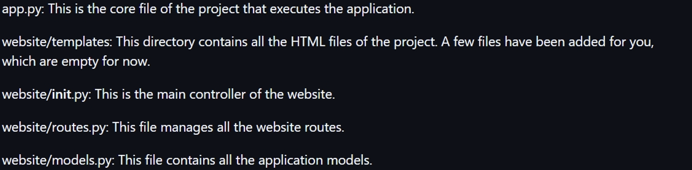

GPT-3, the third iteration of the Generative Pre-trained Transformer series, is a state-of-the-art neural network model designed to generate human-like text. Trained on nearly 570 GB of text data, it boasts 175 billion parameters and requires approximately 800 GB of storage. The quality of text generated by GPT-3 is so advanced that it is often indistinguishable from human writing.

**Project Description**

This project involves creating a chatbot using Flask, a lightweight web framework for Python. The chatbot will be powered by GPT-3 through API integration, enabling it to generate intelligent and context-aware responses to user queries. Additionally, the system will maintain a comprehensive log of all user queries and corresponding API responses for reference and analysis.


# Steps to Use the ChatBot

## Prerequisites
- **OpenAI API Key**: Ensure you have a valid OpenAI API Key before proceeding.

---

## Installation

1. **Install Required Dependencies**:
   Run the following command to install all necessary packages:
   ```bash
   pip install -r requirements.txt

## Set Up Your API Key

Open the file located at `Code/BotDefinition.py`.

Store your OpenAI API Key in this file.

## Running the ChatBot

### Terminal-Based ChatBot:

Run the following script to start the chatbot in the terminal:

```bash
python Code/ChatBot.py
```

### WebApp-Based ChatBot:

For a GUI/WebApp version, run:

```bash
python Code/GuiChatBot.py
```

## Usage

Enter your prompts into the ChatBot to receive responses.
To terminate the chat, type:

```mathematica
End Chat
```

